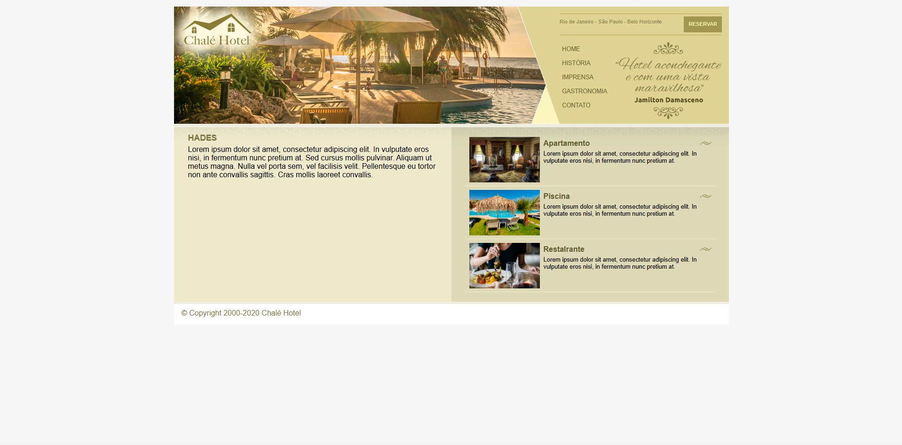

  <h1>Projeto: Jogo Mata Mosquito</h1> 
  
  
Projeto desenvolvido para aprimorar habilidades em desenvolvimento front-end.

---

## Sobre o Projeto

Este projeto é um jogo onde precisamos clicar na mosca dentro do tempo estimado. Foi criado com o objetivo de praticar e demonstrar conhecimentos em tecnologias front-end, com foco em Java Script.

---

## Tecnologias Utilizadas

- **HTML5** – estrutura da página
- **CSS3** – estilização personalizada
- **Bootstrap** – framework para responsividade e componentes
- **JS** – back-end

---

## Preview

